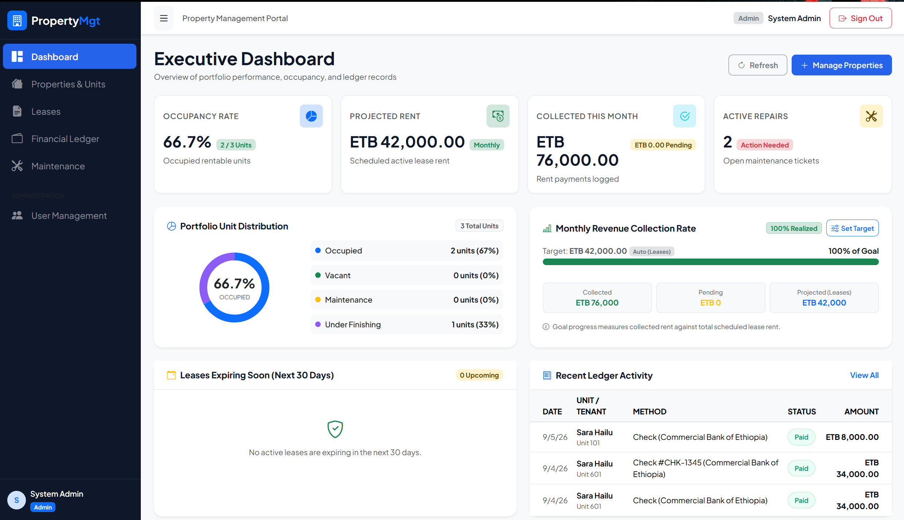
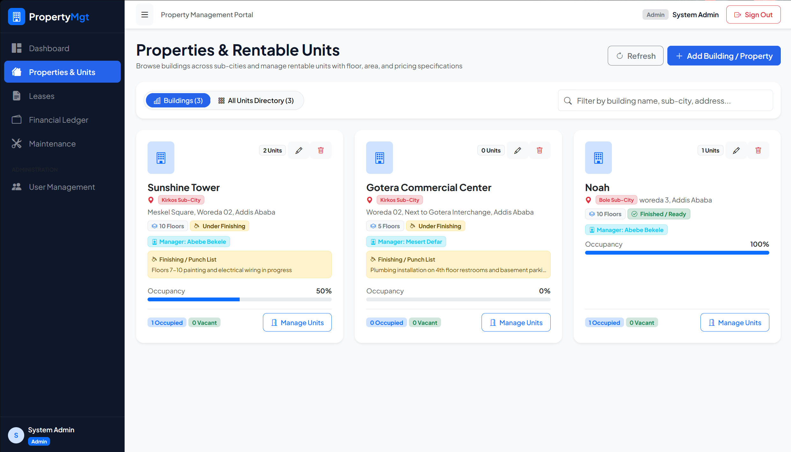
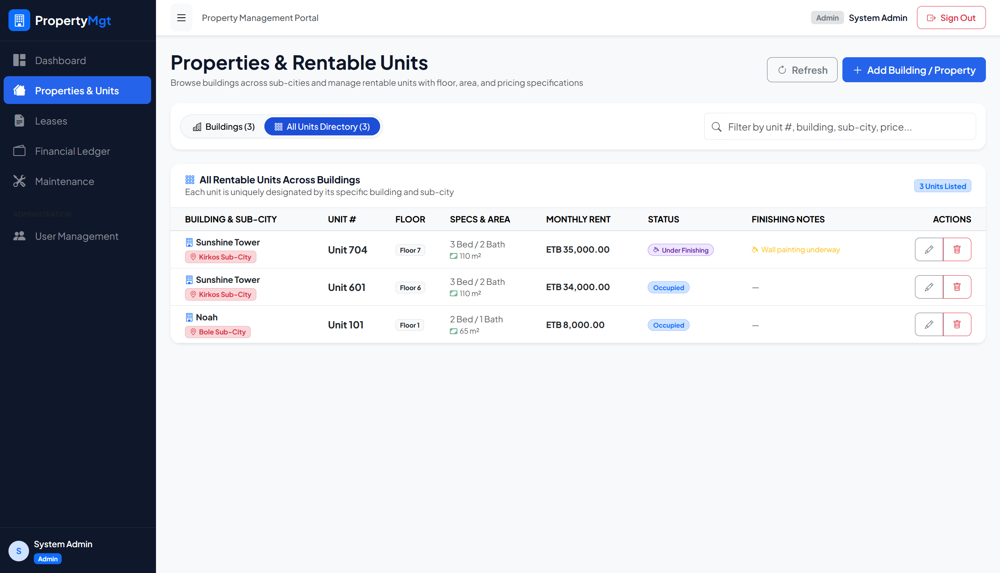
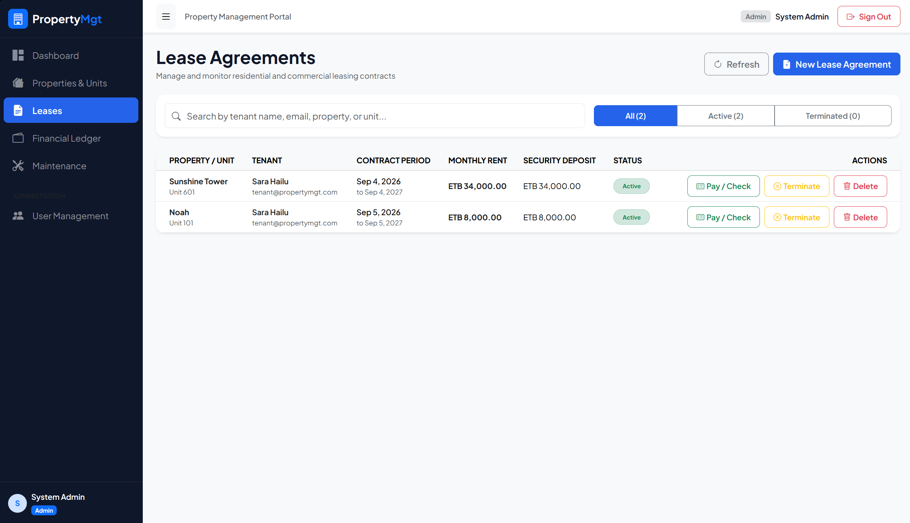
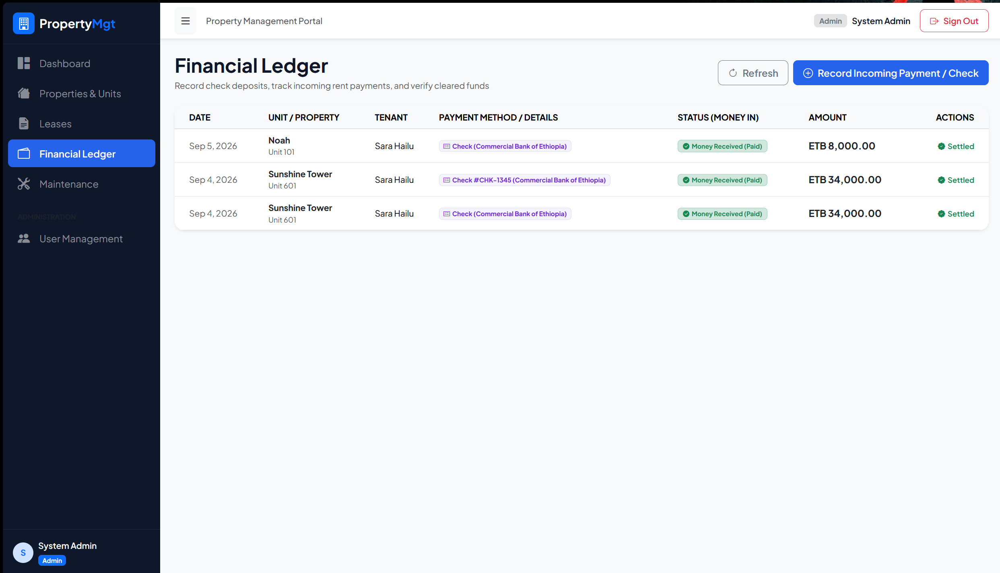
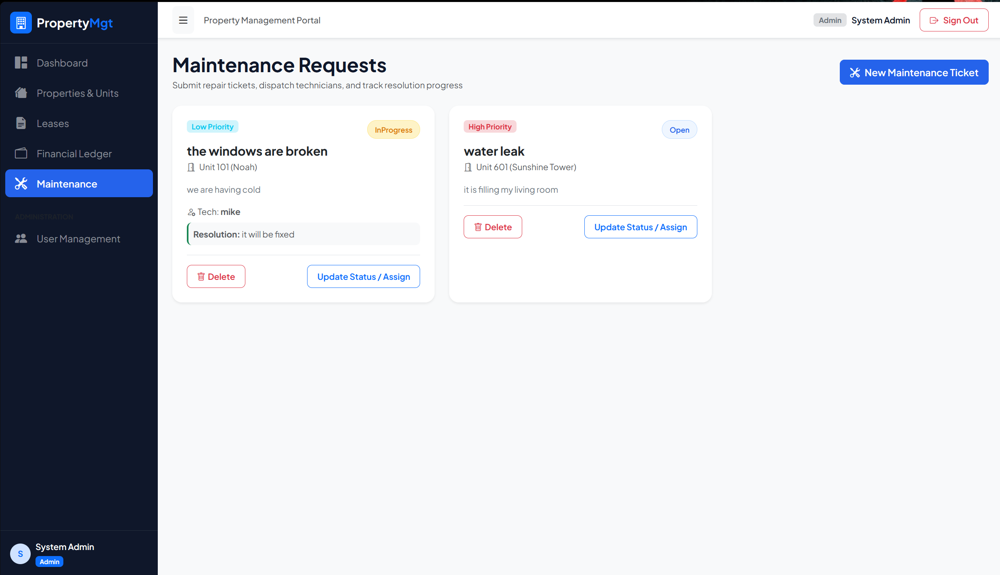
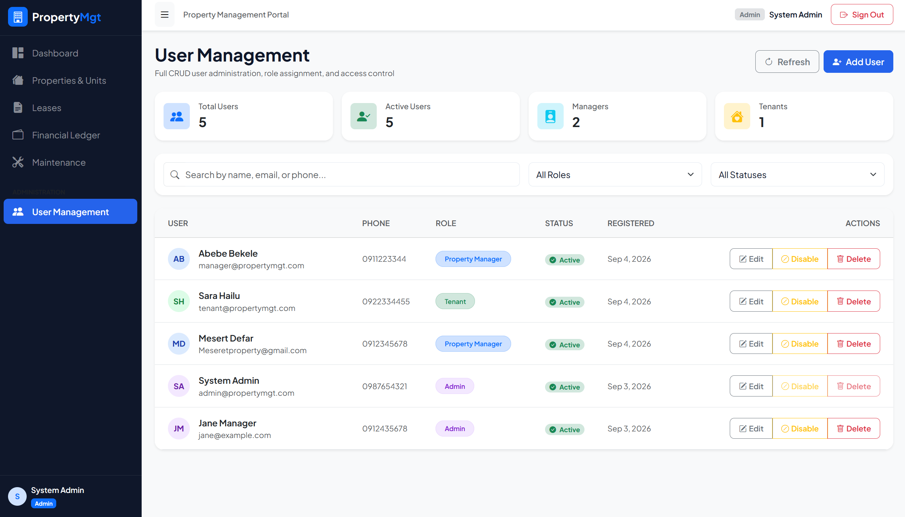
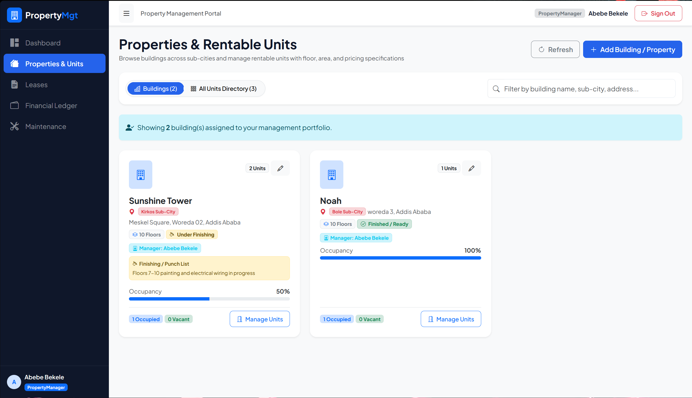
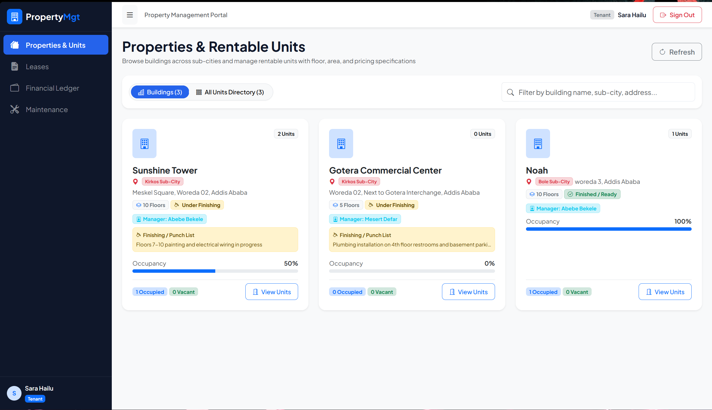

# Property Management System

A modern, full-stack property management platform built with Angular and .NET. Designed to streamline property operations, lease management, financial tracking, and maintenance requests for property managers and administrators.

## Overview

The Property Management System is a comprehensive solution for managing residential and commercial properties. It provides tools for tracking properties, units, leases, tenants, financial transactions, and maintenance requests all in one centralized platform.

## Features

### Core Features
- **Property Management**
  - Create and manage multiple properties
  - Track property details (location, floors, construction status)
  - Assign property managers to properties
  - View unit occupancy and status

- **Unit Management**
  - Manage individual units within properties
  - Track unit details (bedrooms, bathrooms, square footage, rent amount)
  - Monitor unit status (Vacant, Occupied, Under Maintenance)
  - Record finishing notes and specifications

- **Lease Management**
  - Create and track lease agreements
  - Monitor lease terms and conditions
  - Manage tenant information
  - Track lease status and expiration dates

- **Financial Management**
  - Track rental income and expenses
  - Generate financial reports
  - Monitor payment collection rates
  - Set custom revenue targets
  - View financial dashboards with key metrics

- **Maintenance Request System**
  - Submit and track maintenance requests
  - Set priority levels and status tracking
  - Assign maintenance tasks
  - Track completion and notes

- **User Management**
  - Role-based access control (Admin, Property Manager, Tenant)
  - User profile management
  - Secure authentication with JWT tokens
  - User activity tracking

- **Dashboard**
  - Real-time overview of key metrics
  - Occupancy rates
  - Revenue tracking
  - Recent activities
  - Financial summaries


## Project Structure

```
propert-mgt/
├── pms-client/                          # Angular Frontend Application
│   ├── src/
│   │   ├── app/
│   │   │   ├── core/                   # Core services, guards, interceptors, models
│   │   │   ├── features/               # Feature modules (properties, leases, financial, etc.)
### Backend
- **Runtime**: .NET 10
- **API**: ASP.NET Core
- **ORM**: Entity Framework Core 10
- **Authentication**: JWT (JSON Web Tokens)
- **Database**: SQL Server (configured via migrations)
- **API Documentation**: Swagger/Scalar
│   ├── angular.json                    # Angular CLI configuration
│   └── package.json
│
├── src/                                 # .NET Backend
│   ├── PropertyManagement.API/          # ASP.NET Core API project
│   │   ├── Controllers/                # API endpoints
│   │   ├── Middlewares/                # Error handling, logging
│   │   ├── Extensions/                 # Service registration, Swagger
│   │   └── Program.cs                  # API startup configuration
│   │
│   ├── PropertyManagement.Application/ # Application services layer
│   │   ├── Services/                   # Business logic services
│   │   ├── Models/                     # DTOs and request/response models
│   │   └── Common/                     # Interfaces and abstractions
│   │
│   ├── PropertyManagement.Domain/      # Domain entities and logic
│   │   ├── Entities/                   # Core domain models
│   │   └── Enums/                      # Domain enumerations
│   │
│   └── PropertyManagement.Infrastructure/  # Data access and external services
│       ├── Data/                       # DbContext, migrations, configurations
│       ├── Identity/                   # Authentication and authorization
│       ├── Services/                   # Infrastructure implementations
│       └── Seeding/                    # Database seeding
│
└── tests/                              # Test projects
    └── PropertyManagement.Tests/       # Unit and integration tests

```

## Screenshots

### Admin Dashboard

*Admin dashboard displaying key metrics, occupancy rates, and financial summaries*

### Property Management

*Property listing and management interface*

### Unit Management

*Unit management and status tracking*

### Lease Management

*Lease agreement tracking and management*

### Financial Reports

*Financial tracking and revenue analysis*

### Maintenance Requests

*Maintenance request submission and tracking*

### User Management

*User administration and role management*

### Property Manager Dashboard

*Property manager view with assigned properties and key metrics*

### Tenant Portal

*Tenant interface for lease information and maintenance requests*

## Getting Started

### Prerequisites
- Node.js 18+ and npm
- .NET 10 SDK
- SQL Server or compatible database
- Visual Studio Code or Visual Studio (optional but recommended)

### Frontend Setup

1. Navigate to the frontend directory:
```bash
cd pms-client
```

2. Install dependencies:
```bash
npm install
```

3. Start the development server:
```bash
npm start
```

The frontend will be available at `http://localhost:4300`

### Backend Setup

1. Navigate to the backend directory:
```bash
cd src
```

2. Configure database connection in `PropertyManagement.API/appsettings.json`:
```json
{
  "ConnectionStrings": {
    "DefaultConnection": "Server=YOUR_SERVER;Database=PropertyManagement;Trusted_Connection=true;"
  }
}
```

3. Apply migrations:
```bash
dotnet ef database update --project PropertyManagement.Infrastructure
```

4. Run the API:
```bash
dotnet run --project PropertyManagement.API
```

The API will be available at `http://localhost:5179` 

## API Endpoints

### Authentication
- `POST /api/auth/login` - User login
- `POST /api/auth/register` - User registration
- `POST /api/auth/change-password` - Change password

### Properties
- `GET /api/properties` - List all properties
- `GET /api/properties/{id}` - Get property details
- `POST /api/properties` - Create property
- `PUT /api/properties/{id}` - Update property
- `DELETE /api/properties/{id}` - Delete property

### Units
- `GET /api/units` - List all units
- `GET /api/units/{id}` - Get unit details
- `POST /api/units` - Create unit
- `PUT /api/units/{id}` - Update unit
- `PATCH /api/units/{id}/status` - Update unit status
- `DELETE /api/units/{id}` - Delete unit

### Leases
- `GET /api/leases` - List leases
- `POST /api/leases` - Create lease
- `PUT /api/leases/{id}` - Update lease
- `DELETE /api/leases/{id}` - Delete lease

### Financial
- `GET /api/financial/dashboard` - Financial overview
- `GET /api/financial/transactions` - List transactions
- `POST /api/financial/transactions` - Record transaction

### Maintenance
- `GET /api/maintenance` - List maintenance requests
- `POST /api/maintenance` - Create request
- `PUT /api/maintenance/{id}` - Update request
- `DELETE /api/maintenance/{id}` - Delete request

### Users
- `GET /api/users` - List users
- `GET /api/users/{id}` - Get user details
- `POST /api/users` - Create user
- `PUT /api/users/{id}` - Update user
- `DELETE /api/users/{id}` - Delete user

## Default Credentials

For testing purposes, the system includes default seeded users:

- **Admin Account**
  - Email: `admin@propertymgt.com`
  - Password: `Admin@123456`

- **Property Manager Account**
  - Email: `manager@propertymgt.com`
  - Password: `Manager@123456`

- **Tenant Account**
  - Email: `tenant@propertymgt.com`
  - Password: `Tenant@123456`


## User Roles

### Admin
- Full system access
- User management
- Property management
- Financial reporting
- System configuration

### Property Manager
- Manage assigned properties
- View tenant information
- Handle maintenance requests
- Generate reports for assigned properties

### Tenant
- View lease information
- Submit maintenance requests
- Access personal profile
- View property information

## Development

### Building the Frontend
```bash
cd pms-client
npm run build
```

### Running Tests (Frontend)
```bash
cd pms-client
npm test
```

### Building the Backend
```bash
dotnet build
```

### Running Backend Tests
```bash
dotnet test
```

## Database Migrations

To create a new migration:
```bash
dotnet ef migrations add MigrationName --project PropertyManagement.Infrastructure
```

To apply migrations:
```bash
dotnet ef database update --project PropertyManagement.Infrastructure
```

To rollback the last migration:
```bash
dotnet ef database update PreviousMigrationName --project PropertyManagement.Infrastructure
```

## Configuration

### Frontend Configuration
Edit `pms-client/src/environments/environment.ts` to configure API endpoints:

```typescript
export const environment = {
  production: false,
  apiUrl: 'http://localhost:5179/api'
};
```

### Backend Configuration
Edit `src/PropertyManagement.API/appsettings.json` for backend settings:

```json
{
  "ConnectionStrings": {
    "DefaultConnection": "your_connection_string"
  },
  "JwtSettings": {
    "Secret": "your_jwt_secret",
    "Issuer": "PropertyManagementAPI",
    "Audience": "PropertyManagementClient",
    "ExpiryMinutes": 15
  }
}
```

### Chapa payments

The system supports Chapa hosted checkout for tenant rent payments. The Chapa secret key remains on the ASP.NET Core server; it is never sent to the Angular client.

#### How it works

1. `POST /api/payments/chapa/initialize` creates a unique reference for a pending rent transaction and returns Chapa's hosted checkout URL.
2. The Angular financial ledger redirects the tenant to that URL.
3. After Chapa redirects back to `/payment-result`, the client calls `POST /api/payments/chapa/verify`.
4. The API only marks the rent as paid when Chapa verifies a successful payment with the expected transaction reference, ETB currency, and amount.

#### Test-mode setup and demo

1. Create or sign in to a Chapa account and copy a **Test Secret Key** beginning with `CHASECK_TEST-`.
2. Open PowerShell in the project folder and set the test configuration. Replace the placeholder with your own key; never commit or share it.

```powershell
cd "C:\Users\<your-user>\Desktop\propert mgt"
$env:Chapa__SecretKey = "CHASECK_TEST-your-test-secret-key"
$env:Chapa__ReturnUrl = "http://localhost:4300/payment-result"
dotnet run --project src\PropertyManagement.API
```

3. In a second PowerShell window, start the Angular app:

```powershell
cd "C:\Users\<your-user>\Desktop\propert mgt\pms-client"
npm start
```

4. In the browser, create a pending charge (an Admin or Property Manager can record a payment with **Money Came In** unchecked), then sign in as the tenant.
5. From **Financial Ledger**, select **Pay with Chapa** for the pending charge and complete the test checkout using Chapa's test details.
6. On return, the app verifies the payment. If required, select **Verify Chapa Payment**; this only checks the existing payment and does not start a new charge.
7. Confirm the transaction changes from **Pending Clearance** to **Money Received (Paid)**. The successful test transaction will also appear in the Chapa dashboard.

`localhost` means the app is running only on your own computer, which is appropriate for a classroom test demonstration. Test mode uses no real money.

For production, use a live Chapa secret key and configure `Chapa__ReturnUrl` with the public Angular payment-result URL and `Chapa__CallbackUrl` with the public `GET /api/payments/chapa/callback` URL. Both URLs must be publicly accessible over HTTPS. Apply the included `AddChapaPaymentReferences` migration before taking payments.


## Known Issues

- Chapa checkout requires a valid Chapa test or live account and API key; it cannot be completed without them.

## Future Enhancements

- [ ] Tenant portal for lease and maintenance management
- [ ] Automated rent payment collection
- [ ] SMS/Email notifications
- [ ] Advanced reporting and analytics
- [ ] Mobile application
- [x] Chapa hosted checkout and server-side payment verification
- [ ] Document management system
- [ ] Automated recurring transactions

## Support

For issues, questions, or suggestions, please open an issue on the GitHub repository.

## License

This project is licensed under the MIT License - see the LICENSE file for details.

## Author

Miheretab Fikadu

---

**Last Updated**: September 2026

For more information or to report issues, visit the [GitHub Repository](https://github.com/Miheretab21/fullstack-property-management)
